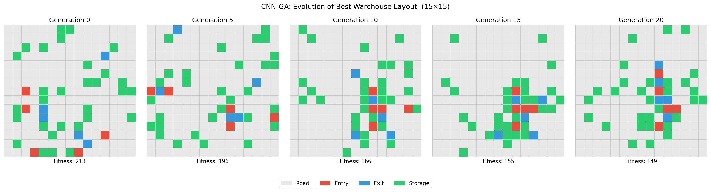
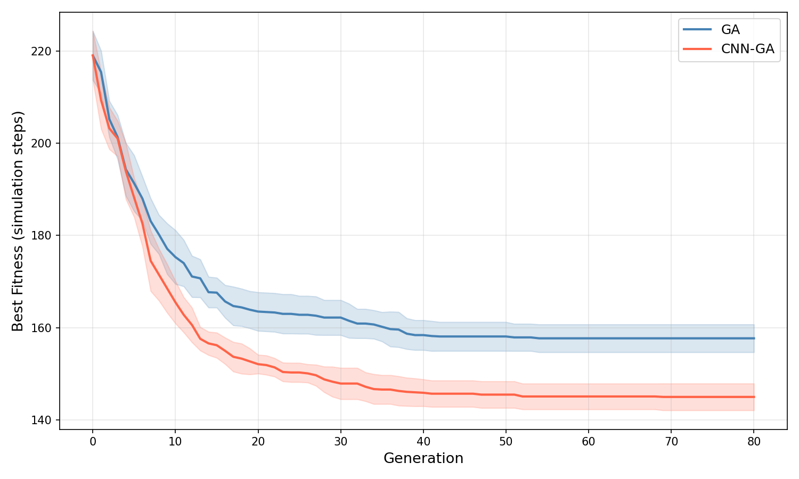
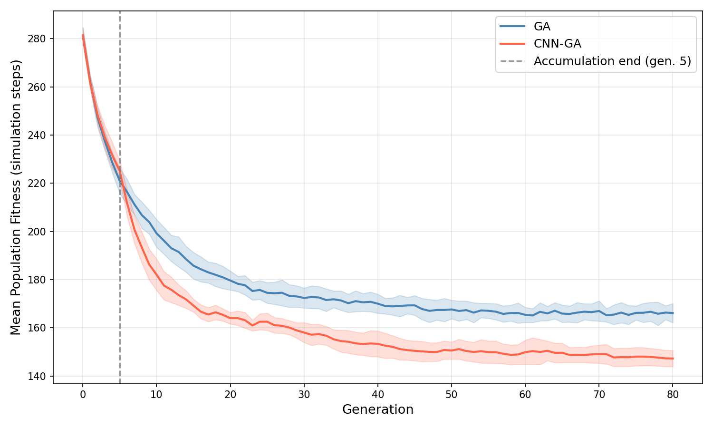
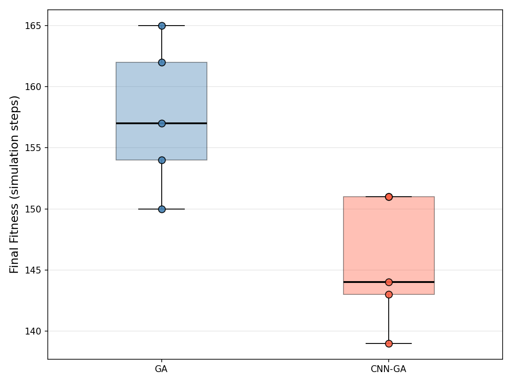
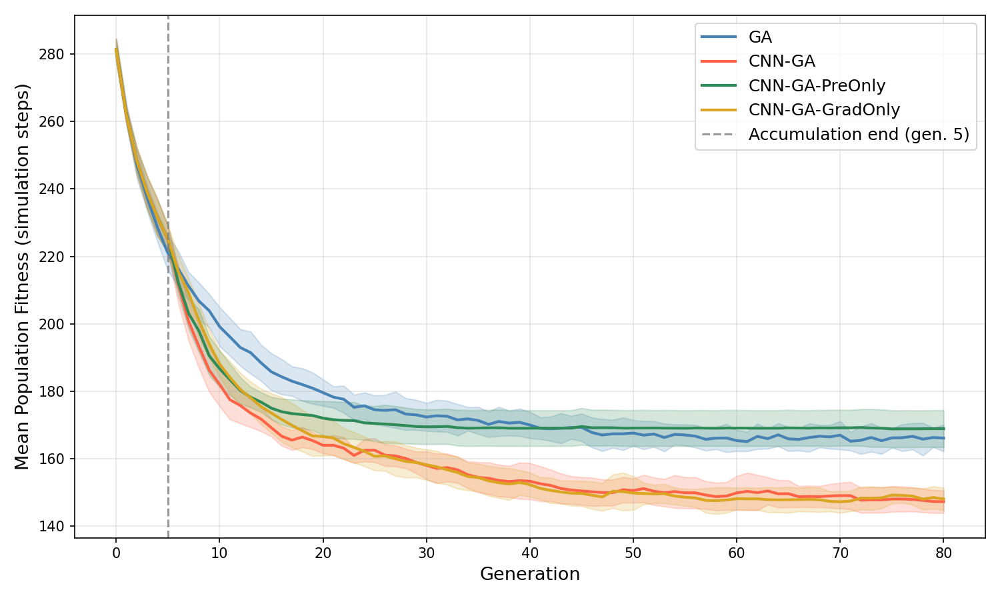
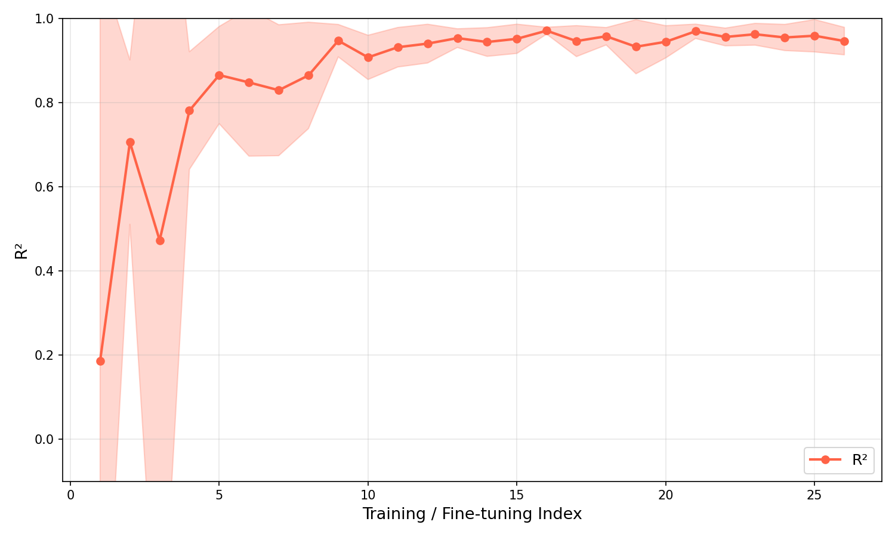

**English** | [Русский](README_RU.md)

# CNN Surrogate with Gradient-Guided Mutation for Warehouse Layout Optimization

> Accepted to **ICRAS 2026**. The numbers below correspond to the camera-ready revision (10 seeds + ablation study).

This project addresses the problem of optimal placement of entry points, exits, and storage zones on the rectangular grid of an automated warehouse. The quality of a configuration is measured by the number of discrete-event simulation steps required to process a fixed number of containers by mobile robots. Two algorithms are implemented: a baseline genetic algorithm (**GA**) and its modification (**CNN-GA**), in which a convolutional neural network acts as a surrogate for the fitness function - both for candidate selection and as a source of gradient for guided mutation.

## Optimization process



Evolution of the best layout over generations (CNN-GA, 15×15 grid).

## Problem formulation

- **Warehouse representation.** A rectangular m×n grid, each cell of one of 4 types: `Road`, `Entry`, `Exit`, `Save`. The number of cells of each type is given as a parameter and preserved throughout optimization.
- **Simulation.** At each step, a container appears at each `Entry` cell with probability `p`. A dispatcher assigns tasks to robots by a nearest-free-robot rule; routes are computed by breadth-first search over the `Road`-cell network. A container follows the path `Entry → Save → Exit`.
- **Objective function.** `T(x)` - the number of simulation steps required to process a given number of containers under configuration `x`. The task is to minimize `T(x)`.

## Method

**GA (baseline).** Tournament selection, single-point horizontal/vertical crossover, relocation mutation (moving a non-Road cell to a random Road position), elitism.

**CNN-GA.** The same operators, plus two mechanisms based on a trained CNN surrogate `f̂_θ(X)`:

1. **Pre-screening.** `α·(N−E)` candidates are generated; the surrogate predicts their fitness, and only the `N−E` best ones are passed to the simulation.
2. **Gradient-guided mutation.** The gradient `∇_X f̂_θ(X)` ranks possible cell relocations; the top-T pairs are verified by a full surrogate forward pass, and the best one is applied.

The first `n_a` generations form the warm-up phase where training data is collected (the surrogate is not used). After that the surrogate is fine-tuned every `r` generations. **The simulation evaluation budget is identical for GA and CNN-GA** - the comparison is fair.

## Installation

```bash
python -m venv .venv
source .venv/bin/activate
pip install -r requirements.txt
```

## Running

Three entry points (from the project root):

```bash
python -m experiments.comparison      # GA vs CNN-GA, 10 seeds - main paper figures (convergence.png, mean_fitness.png, ...)
python -m experiments.ablation        # Adds two CNN-GA modifications (PreOnly, GradOnly) on the same 10 seeds and produces *_ablation.png
python -m experiments.evolution_viz   # Strip of best-layout snapshots over generations
```

Both `comparison` and `ablation` run on the same `SEEDS_10` set and share the same GA/CNN-GA logs in `logs/` (`ablation` reuses them, only the two ablation-specific runs are added). All scripts reuse cached logs - to force a fresh run, delete the corresponding `run_*.json` file.

Interactive example:

```python
from algorithms import GeneticAlgorithm, CNNGuidedGA

ga = GeneticAlgorithm(
    m=15, n=15, entries=5, exits=5, saves=30,
    num_robots=12, containers_to_process=160, prob=0.35,
    pop_size=50, generations=80, n_jobs=-1,
)
best_config, log = ga.run()
best_config.plot()
```

## Results

**Experiment conditions:** 15×15 grid, 5 entries / 5 exits / 30 storage cells, 12 robots, 160 containers, `p=0.35`. Evolution parameters: `N=50`, `G=80`. 10 runs with seeds `{42, 123, 456, 789, 1337, 2024, 31337, 9001, 271828, 161803}`.

### Convergence



Best fitness per generation (mean ± 95% CI, 10 runs). CNN-GA consistently outperforms GA after the surrogate is activated at generation 5; the confidence intervals of the two algorithms dont overlap across the plateau.

### Generations to reach a threshold

Number of generations at which the algorithm first reached the given fitness threshold (mean over runs that reached it; in parentheses - fraction of such runs out of 10).

| Threshold | GA          | CNN-GA      |
|-----------|-------------|-------------|
| ≤210      | 1.8 (10/10) | 1.6 (10/10) |
| ≤200      | 3.7 (10/10) | 3.5 (10/10) |
| ≤190      | 6.2 (10/10) | 5.1 (10/10) |
| ≤180      | 8.8 (10/10) | 6.5 (10/10) |
| ≤170      | 13.8 (10/10)| 8.9 (10/10) |
| ≤165      | 19.4 (10/10)| 10.6 (10/10)|
| ≤160      | 26.2 (8/10) | 12.5 (10/10)|
| ≤155      | 34.0 (3/10) | 15.7 (10/10)|
| ≤150      | 36.0 (1/10) | 22.8 (8/10) |
| ≤145      | - (0/10)    | 32.3 (6/10) |
| ≤140      | - (0/10)    | 34.0 (1/10) |

On loose thresholds the difference is small; starting from ≤170 CNN-GA systematically reaches each level 5-18 generations earlier than GA, and the tight thresholds ≤145 and ≤140 are not reached by GA in any run.

### Mean population fitness



The gap between the algorithms widens immediately after surrogate activation and persists until the end of the runs - the effect of CNN-GA is visible not only in the elite but also in overall population quality.

### Final fitness



Distribution of final values across 10 runs. GA median - 157.5, CNN-GA median - 144.5. Paired t-test: `t=10.328`, `p=2.7×10⁻⁶`, `df=9` - a statistically significant 8.05% advantage of CNN-GA.

### Ablation study



Isolating the contribution of each surrogate-driven component over 10 runs reveals a clear picture. Aggressive intensification by the surrogate filter collapses population diversity, and random relocation mutation cannot escape the resulting local optima- visible as the early-flattening green curve above. **Gradient-guided mutation alone matches the full CNN-GA**, identifying it as the dominant source of the improvement. Pre-screening is retained in the final model because it adds no simulation-budget cost and provides an independent fallback during the first generations after surrogate activation, when R² is still unstable.

### Surrogate quality



Coefficient of determination `R²` of the surrogate across fine-tuning cycles. After a few early high-variance cycles it levels off at ≈0.95 - predictions are close to the true values, which explains why the gradient signal is informative for the mutation.

## Project structure

```
.
|-- algorithms/         # GA, CNN-GA, surrogate, mutation operators
|-- experiments/        # comparison.py, ablation.py, evolution_viz.py, cases.py, plots.py
|-- simulation.py       # discrete-event warehouse simulator
|-- individual.py       # configuration genome
|-- metrics.py          # spatial metrics
|-- constants.py        # cell-type and state enums
|-- plots/              # generated figures (png)
|-- logs/               # cached run logs (json)
\-- requirements.txt
```
